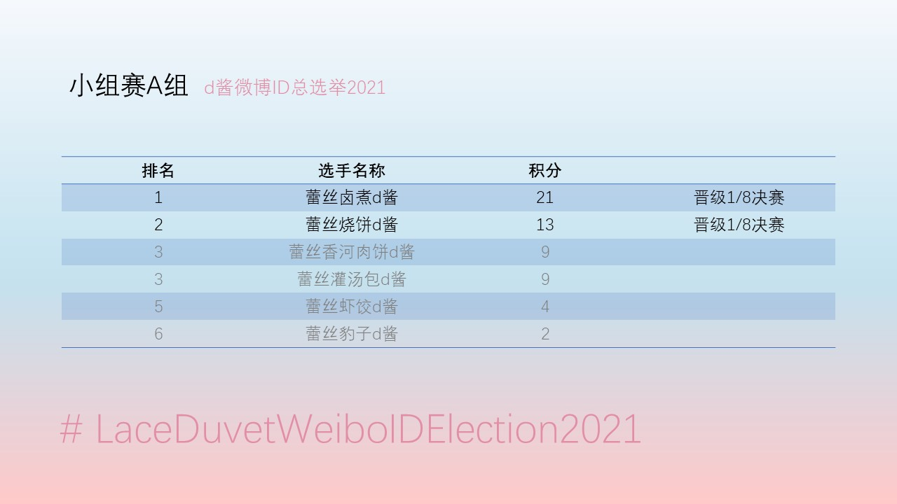
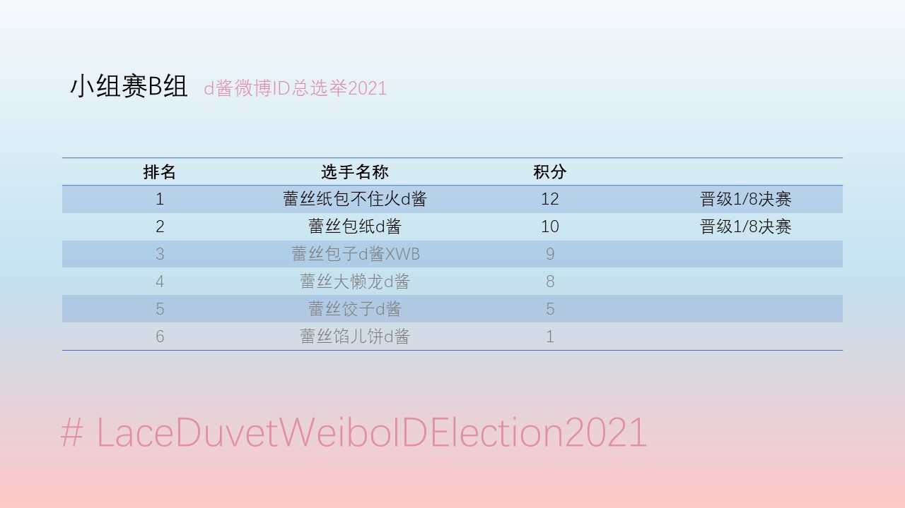
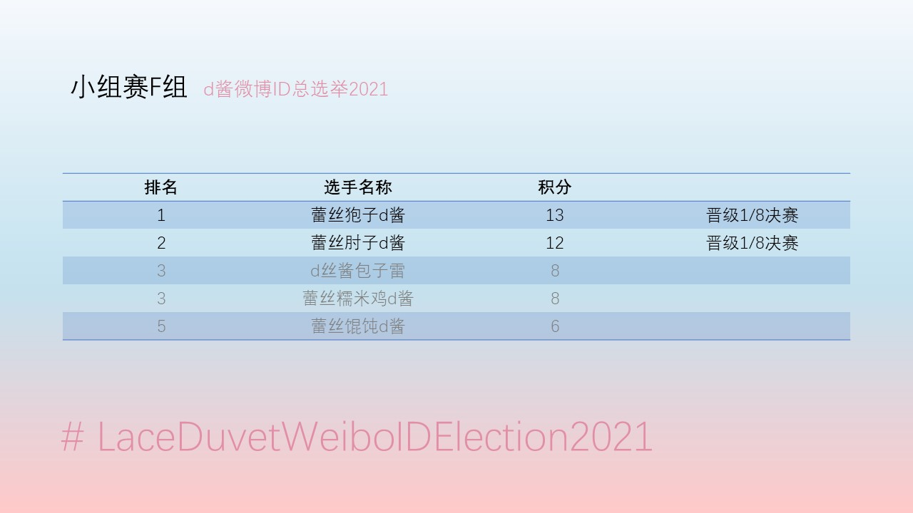

# LaceDuvetWeiboIDElection2021

由于微博用户[@蕾丝包子d酱](https://weibo.com/n/%E8%95%BE%E4%B8%9D%E5%8C%85%E5%AD%90d%E9%85%B1 "这个家伙的微博")想要改名，
为了解决他的选择困难症，我们特此进行【2021年d酱微博ID总选举】活动！

你认为哪个ID更适合d酱？

## 赛程介绍
本次比赛共有44个选手参加比赛，采取赛会制方案。
最终将选出一位冠军ID，作为d酱的微博新ID。
我们选ID的原则，不仅要好听，还要符合d酱的气质： 高贵、优雅、~~色气~~。

<b>特别提醒</b>：事实上“蕾丝包子d酱”这一ID当事人已经使用多年，对其有特殊的意义。所以即便本次比赛选出一个ID，当事人也未必会更换。比赛后请不要催促或质疑d酱是否更换ID这一事情，举办本次比赛的目的是给大家带来快乐。

> <b>今日赛程</b>
> 
> 今天是11月3日，正在进行小组赛C组和G组的比赛，您可以[点击这里](https://tp.wjx.top/vj/m3scTrk.aspx)进入投票页面。

### 测试赛
10月31日将举行总选举的测试赛，用于最终决定使用何种方式开展投票。

测试赛采用的投票渠道为问卷星，您可以点击下面的地址进入投票。
投票截止时间为2021年10月31日18:00。如果因为微博限制访问等原因导致投票不能正常进行，我们将更换渠道。
如果投票可以正常进行，我们将使用问卷星作为本次总选举的投票渠道。测试赛投票结果不计入比赛结果。

[测试赛投票链接](https://tp.wjx.top/vj/eBTkmRw.aspx)
### 小组赛
我们首先将44位选手分成8组，其中A, B, C, D组每组6个选手， E, F, G, H组每组5个选手。分组采取随机抽签方式。
之后我们每天将进行2个小组的小组赛，观众通过投票选出自己青睐的选手。

11月1日：举行A组、E组的小组赛。得票最多的2位选手晋级。

[11月1日小组赛投票链接](https://tp.wjx.top/vj/OWacNTp.aspx) 

11月2日：举行B组、F组的小组赛。得票最多的2位选手晋级。

[11月2日小组赛投票链接](https://tp.wjx.top/vj/Q0JYaTT.aspx)

11月3日：举行C组、G组的小组赛。得票最多的2位选手晋级。
投票时间：11月3日 0:00 - 22:00

[11月3日小组赛投票链接](https://tp.wjx.top/vj/m3scTrk.aspx)

11月4日：举行D组、H组的小组赛。得票最多的2位选手晋级。

11月5日：如果小组赛中有第二、三名平局的情况，将邀请特别评委d酱参与评审，d酱有投一票等于两票的权利。如果仍未分出胜负，将进行加时赛。

小组赛过后，将共有16位选手晋级1/8决赛！
#### 分组情况及小组赛结果

#### A组

蕾丝豹子d酱 / 蕾丝虾饺d酱 / 蕾丝香河肉饼d酱 / 蕾丝灌汤包d酱 / 蕾丝烧饼d酱 / 蕾丝卤煮d酱

#### B组

蕾丝包纸d酱 / 蕾丝大懒龙d酱 / 蕾丝包子d酱XWB / 蕾丝饺子d酱 / 蕾丝馅儿饼d酱 / 蕾丝纸包不住火d酱

#### C组

蕾丝傻子d酱

蕾丝流心奶黄包d酱

蕾丝勺子d酱

蕾丝包孑d酱

蕾丝面条炸酱

蕾丝雹子d酱

#### D组

蕾丝勾子d酱

法蕾缝纫机d酱

蕾丝麻酱糖饼d酱

蕾丝被子d酱

蕾丝汤圆d酱

蕾丝包孓d酱

#### E组

蕾丝豆汁d酱 / 蕾丝包包d酱 / 蕾丝馒头d酱 / 蕾包丝子d酱 / 蕾丝傻狍子d酱

#### F组

蕾丝狍子d酱 / 蕾丝肘子d酱 / 蕾丝馄饨d酱 / 蕾丝糯米鸡d酱 / d丝酱包子雷

#### G组

蕾丝锅盔d酱

蕾丝元宵d酱

蕾丝包了d酱

蕾丝烧卖d酱

蕾丝糯米团子d酱

#### H组

蕾丝丸子d酱

蕾包子丝d酱

蕾丝夹馍蘸大酱

蕾丝叉烧包d酱

蕾丝粽子d酱

### 1/8决赛
小组赛之后将有16位选手胜出，我们将重新进行抽签，对这16位选手进行分组。
最终将分为两两对决的8组进行1/8决赛。

11月8日：举行第一场、第二场1/8决赛，每场比赛的胜者晋级1/4决赛。

11月9日：举行第三场、第四场1/8决赛，每场比赛的胜者晋级1/4决赛。

11月10日：举行第五场、第六场1/8决赛，每场比赛的胜者晋级1/4决赛。

11月11日：举行第七场、第八场1/8决赛，每场比赛的胜者晋级1/4决赛。

11月12日：如果1/8决赛中出现平局，则比较二者在小组赛中的积分，小组赛积分多者胜出。如果仍然平局，将举行加时赛。

### 1/4决赛
1/8决赛后将有8位选手胜出，我们将按照顺序进行1/4决赛。

11月15日：举行第一场、第二场1/4决赛，
第一场对局双方为第一场、第二场1/8决赛的胜者，
第二场对局双方为第三场、第四场1/8决赛的胜者，
每场比赛的胜者晋级半决赛。

11月16日：举行第三场、第四场1/4决赛，
第三场对局双方为第五场、第六场1/8决赛的胜者，
第四场对局双方为第七场、第八场1/8决赛的胜者，
每场比赛的胜者晋级半决赛。
   
### 半决赛
1/4决赛后将有4位选手胜出，我们将按照顺序进行半决赛。

11月17日：举行第一场、第二场半决赛，
第一场对局双方为第一场、第二场1/4决赛的胜者，
第二场对局双方为第三场、第四场1/4决赛的胜者，
每场比赛的胜者晋级决赛。
### 决赛
半决赛后将有2位选手胜出。

11月18日：举行决赛。
决赛的胜者为“2021年d酱微博ID总选举”冠军。

如果因不可抗力导致比赛不能正常进行，如投票渠道无法访问、主办方偷懒等原因，赛程将顺延。

## 本次参赛选手名单
### 带馅儿食物类

蕾丝馒头d酱

蕾丝丸子d酱

蕾丝饺子d酱

蕾丝叉烧包d酱

蕾丝流心奶黄包d酱

蕾丝汤圆d酱

蕾丝元宵d酱

蕾丝粽子d酱

蕾丝糯米团子d酱

蕾丝馄饨d酱

蕾丝烧卖d酱

蕾丝虾饺d酱

蕾丝馅儿饼d酱

蕾丝大懒龙d酱

蕾丝香河肉饼d酱

蕾丝糯米鸡d酱

蕾丝灌汤包d酱

蕾丝锅盔d酱

蕾丝夹馍蘸大酱

### 不带馅儿食物类

蕾丝肘子d酱

蕾丝面条炸酱

蕾丝卤煮d酱

蕾丝豆汁d酱

蕾丝烧饼d酱

蕾丝麻酱糖饼d酱

### 谐音类

蕾丝雹子d酱

蕾丝包纸d酱

蕾丝豹子d酱

蕾丝狍子d酱

蕾丝傻狍子d酱

### 排列组合类

蕾包子丝d酱

蕾包丝子d酱

d丝酱包子雷

### 形近字类

蕾丝包包d酱

蕾丝包孑d酱

蕾丝包孓d酱

蕾丝包了d酱

蕾丝勾子d酱

蕾丝勺子d酱

### 忠实翻译类（duvet）

蕾丝被子d酱

### 精神病类

蕾丝包子d酱XWB

蕾丝傻子d酱

法蕾缝纫机d酱

蕾丝纸包不住火d酱